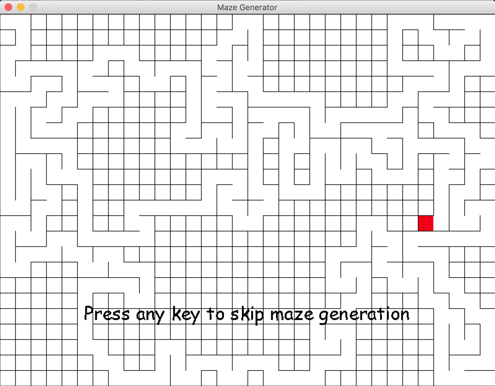

# Maze Generator

This is a mini maze game. You start at top-left corner and your goal is to go to bottom-right corner. You can skip the animation of maze generation.

Use 
```
python maze.py
```
 to run the game, you need PyGame installed in your system.

Adjust size of screen and size of maze in parameter.py.




